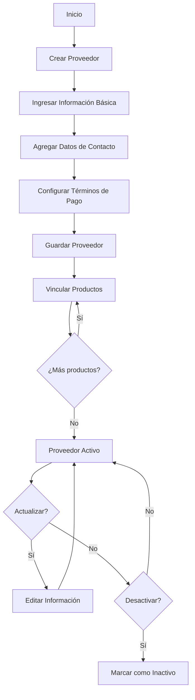
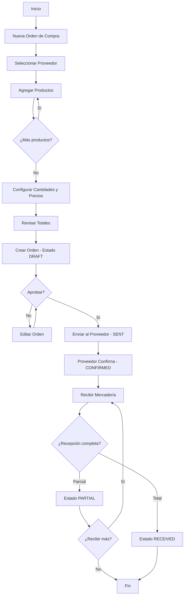
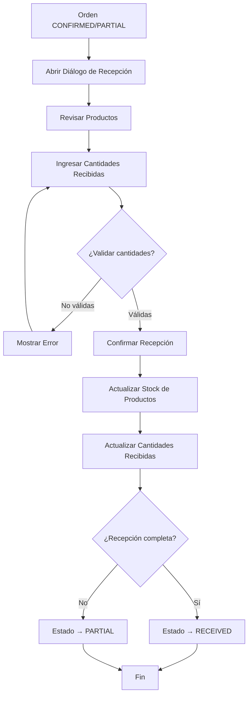
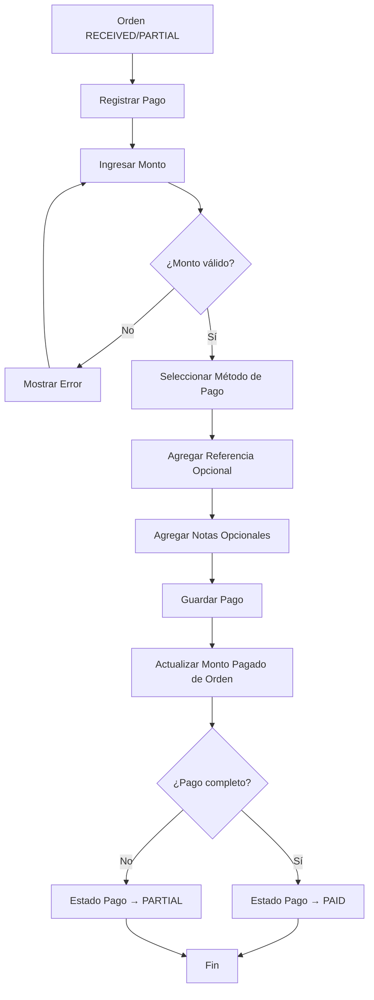
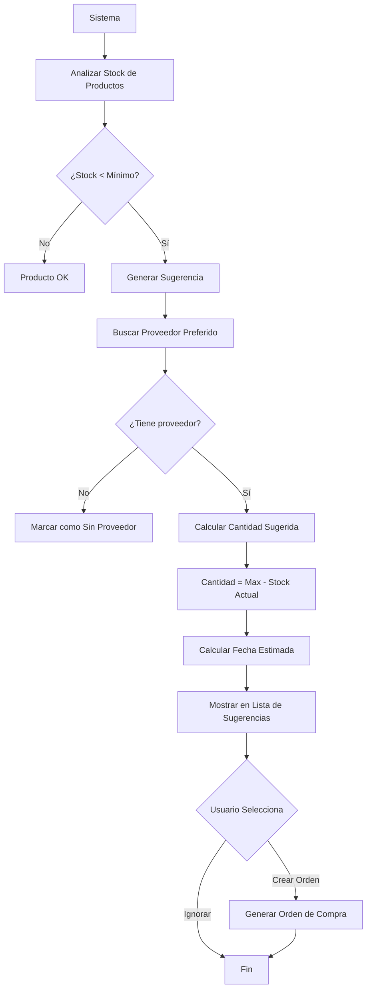

# Sistema de Proveedores y Órdenes de Compra

## Índice

1. [Descripción General](#descripción-general)
2. [Arquitectura del Sistema](#arquitectura-del-sistema)
3. [Módulos Principales](#módulos-principales)
4. [Flujos de Trabajo](#flujos-de-trabajo)
5. [Base de Datos](#base-de-datos)
6. [API Endpoints](#api-endpoints)
7. [Características de la Aplicación Móvil](#características-de-la-aplicación-móvil)
8. [Sincronización Offline](#sincronización-offline)
9. [Permisos y Seguridad](#permisos-y-seguridad)
10. [Guía de Usuario](#guía-de-usuario)

---

## Descripción General

El sistema de Proveedores y Órdenes de Compra es un módulo completo para la gestión de compras que incluye:

- **Gestión de Proveedores**: CRUD completo con información de contacto, términos de pago y productos asociados
- **Órdenes de Compra**: Flujo completo desde borrador hasta recepción de mercadería
- **Gestión de Pagos**: Registro de pagos parciales y totales con múltiples métodos de pago
- **Sugerencias de Reorden**: Sistema inteligente que detecta productos con stock bajo y sugiere órdenes de compra
- **Soporte Offline**: Capacidad de trabajar sin conexión en la aplicación móvil

### Características Principales

✅ Multi-tenancy con aislamiento de datos por tenant
✅ RBAC (Role-Based Access Control) completo
✅ Aplicación web y móvil sincronizadas
✅ Soporte offline con cola de sincronización
✅ Cálculo automático de totales con impuestos
✅ Seguimiento de estados y transiciones validadas
✅ Gestión de múltiples ubicaciones
✅ Transferencias de stock entre ubicaciones

---

## Arquitectura del Sistema

### Stack Tecnológico

**Backend:**
- NestJS con TypeScript
- Prisma ORM
- PostgreSQL
- Autenticación JWT

**Frontend Web:**
- Next.js 13+ (App Router)
- React 18
- TanStack Query (React Query)
- shadcn/ui
- Tailwind CSS

**Frontend Mobile:**
- React Native (Expo)
- Expo Router
- AsyncStorage
- NetInfo (detección de conectividad)

### Estructura de Directorios

```
kalynt/
├── apps/
│   ├── api/                          # Backend NestJS
│   │   └── src/
│   │       └── modules/
│   │           ├── suppliers/        # Módulo de proveedores
│   │           ├── purchase-orders/  # Módulo de órdenes de compra
│   │           └── payments/         # Módulo de pagos
│   ├── web/                          # Frontend web Next.js
│   │   └── app/
│   │       ├── suppliers/
│   │       └── purchases/
│   │           ├── orders/
│   │           └── reorder/
│   └── mobile/                       # App móvil React Native
│       └── app/
│           ├── suppliers/
│           ├── purchase-orders/
│           └── lib/
│               ├── api/              # Clientes API
│               └── sync/             # Servicios de sincronización
├── packages/
│   └── database/                     # Esquema Prisma compartido
│       └── prisma/
│           └── schema.prisma
├── tests/
│   └── e2e/
│       ├── fixtures/                 # Helpers de datos de prueba
│       └── specs/                    # Tests E2E con Playwright
└── docs/
    └── SUPPLIERS_PURCHASE_ORDERS.md  # Este documento
```

---

## Módulos Principales

### 1. Proveedores (Suppliers)

**Entidad Principal:** `Supplier`

**Campos:**
- Información básica: nombre, código, tax ID
- Contacto: email, teléfono, sitio web, persona de contacto
- Dirección: calle, ciudad, estado, código postal, país
- Términos de pago: plazo de pago, moneda
- Información bancaria: banco, cuenta
- Estado: activo/inactivo

**Relaciones:**
- `SupplierProduct`: Productos que suministra con precio de costo, SKU del proveedor, cantidad mínima de orden, tiempo de entrega
- `PurchaseOrder`: Órdenes de compra realizadas al proveedor

### 2. Órdenes de Compra (Purchase Orders)

**Entidad Principal:** `PurchaseOrder`

**Estados del Ciclo de Vida:**
```
DRAFT → SENT → CONFIRMED → PARTIAL/RECEIVED → (CANCELLED)
```

**Estados de Pago:**
```
PENDING → PARTIAL → PAID
```

**Campos:**
- Número de orden (auto-generado: PO-00001)
- Proveedor
- Estado (status)
- Estado de pago (paymentStatus)
- Fechas: orden, esperada, recepción
- Ubicación de destino
- Montos: subtotal, impuestos, descuento, envío, total
- Monto pagado
- Notas públicas y privadas

**Relaciones:**
- `PurchaseOrderItem`: Items de la orden con cantidades ordenadas/recibidas
- `Payment`: Pagos realizados a la orden

### 3. Items de Orden (Purchase Order Items)

**Entidad:** `PurchaseOrderItem`

**Campos:**
- Producto (con snapshot de nombre y SKU)
- Cantidad ordenada
- Cantidad recibida
- Costo unitario
- Tasa de impuesto (%)
- Descuento
- Subtotal, monto de impuesto, total

### 4. Pagos (Payments)

**Entidad:** `Payment`

**Campos:**
- Número de pago (auto-generado: PAY-00001)
- Orden de compra asociada
- Monto
- Método de pago (Efectivo, Transferencia, Cheque, etc.)
- Fecha de pago
- Referencia (número de transacción)
- Notas

### 5. Productos Proveedor (Supplier Products)

**Entidad:** `SupplierProduct`

**Campos:**
- Proveedor
- Producto
- Costo
- SKU del proveedor
- Cantidad mínima de orden
- Tiempo de entrega (días)
- Es proveedor preferido (boolean)

---

## Flujos de Trabajo

### Flujo 1: Gestión de Proveedores



**Pasos:**
1. Crear nuevo proveedor desde `/suppliers`
2. Completar formulario con 3 pestañas:
   - **Información General**: Nombre, código, tax ID
   - **Contacto**: Email, teléfono, dirección, sitio web
   - **Pago**: Términos de pago, moneda, datos bancarios
3. Guardar proveedor
4. Vincular productos desde la pantalla de detalle del proveedor

### Flujo 2: Creación de Orden de Compra



**Transiciones de Estado Permitidas:**
- `DRAFT` → `SENT`: Enviar orden al proveedor
- `SENT` → `CONFIRMED`: Proveedor confirma la orden
- `CONFIRMED` → `PARTIAL`: Recepción parcial de mercadería
- `CONFIRMED` → `RECEIVED`: Recepción completa de mercadería
- `PARTIAL` → `RECEIVED`: Completar recepción de mercadería
- Cualquier estado → `CANCELLED`: Cancelar orden

### Flujo 3: Recepción de Mercadería



**Validaciones:**
- No se puede recibir más de lo ordenado
- Las cantidades deben ser positivas
- Solo órdenes en estado `CONFIRMED` o `PARTIAL` pueden recibir mercadería

### Flujo 4: Gestión de Pagos



**Validaciones:**
- El monto no puede exceder el saldo pendiente
- El monto debe ser mayor a 0
- Se requiere método de pago

**Métodos de Pago Soportados:**
- Efectivo
- Transferencia Bancaria
- Cheque
- Tarjeta de Crédito
- Tarjeta de Débito

### Flujo 5: Sugerencias de Reorden



**Lógica de Sugerencias:**
- Detecta productos con `stock < minStock`
- Calcula cantidad sugerida: `maxStock - currentStock`
- Prioriza proveedores marcados como preferidos
- Agrupa sugerencias por proveedor
- Calcula fecha estimada de entrega: `hoy + leadTimeDays`

---

## Base de Datos

### Esquema Prisma

**Modelo Supplier:**
```prisma
model Supplier {
  id            String   @id @default(cuid())
  tenantId      String
  name          String
  code          String   @unique
  taxId         String?
  email         String?
  phone         String?
  website       String?
  address       String?
  city          String?
  state         String?
  zipCode       String?
  country       String?
  contactName   String?
  contactPhone  String?
  contactEmail  String?
  paymentTerms  String?
  currency      String?
  bankName      String?
  bankAccount   String?
  notes         String?
  isActive      Boolean  @default(true)
  createdAt     DateTime @default(now())
  updatedAt     DateTime @updatedAt

  tenant          Tenant             @relation(fields: [tenantId], references: [id])
  products        SupplierProduct[]
  purchaseOrders  PurchaseOrder[]

  @@index([tenantId])
  @@index([code])
}
```

**Modelo PurchaseOrder:**
```prisma
model PurchaseOrder {
  id              String   @id @default(cuid())
  tenantId        String
  supplierId      String
  orderNumber     String   @unique
  status          PurchaseOrderStatus @default(DRAFT)
  paymentStatus   PaymentStatus       @default(PENDING)
  orderDate       DateTime @default(now())
  expectedDate    DateTime?
  receivedDate    DateTime?
  locationId      String?
  createdById     String
  subtotal        Decimal  @default(0)
  taxAmount       Decimal  @default(0)
  discount        Decimal  @default(0)
  shippingCost    Decimal  @default(0)
  totalAmount     Decimal  @default(0)
  paidAmount      Decimal  @default(0)
  notes           String?
  internalNotes   String?
  createdAt       DateTime @default(now())
  updatedAt       DateTime @updatedAt

  tenant      Tenant              @relation(fields: [tenantId], references: [id])
  supplier    Supplier            @relation(fields: [supplierId], references: [id])
  location    Location?           @relation(fields: [locationId], references: [id])
  createdBy   User                @relation(fields: [createdById], references: [id])
  items       PurchaseOrderItem[]
  payments    Payment[]

  @@index([tenantId])
  @@index([supplierId])
  @@index([orderNumber])
  @@index([status])
  @@index([paymentStatus])
}

enum PurchaseOrderStatus {
  DRAFT
  SENT
  CONFIRMED
  PARTIAL
  RECEIVED
  CANCELLED
}

enum PaymentStatus {
  PENDING
  PARTIAL
  PAID
}
```

**Modelo PurchaseOrderItem:**
```prisma
model PurchaseOrderItem {
  id                String   @id @default(cuid())
  purchaseOrderId   String
  productId         String
  productName       String
  productSku        String
  quantityOrdered   Int
  quantityReceived  Int      @default(0)
  unitCost          Decimal
  taxRate           Decimal  @default(0)
  discount          Decimal  @default(0)
  subtotal          Decimal
  taxAmount         Decimal
  totalAmount       Decimal
  createdAt         DateTime @default(now())
  updatedAt         DateTime @updatedAt

  purchaseOrder PurchaseOrder @relation(fields: [purchaseOrderId], references: [id], onDelete: Cascade)
  product       Product       @relation(fields: [productId], references: [id])

  @@index([purchaseOrderId])
  @@index([productId])
}
```

**Modelo Payment:**
```prisma
model Payment {
  id               String   @id @default(cuid())
  tenantId         String
  purchaseOrderId  String
  paymentNumber    String   @unique
  amount           Decimal
  paymentMethod    String
  paymentDate      DateTime @default(now())
  reference        String?
  notes            String?
  createdById      String
  createdAt        DateTime @default(now())
  updatedAt        DateTime @updatedAt

  tenant        Tenant        @relation(fields: [tenantId], references: [id])
  purchaseOrder PurchaseOrder @relation(fields: [purchaseOrderId], references: [id])
  createdBy     User          @relation(fields: [createdById], references: [id])

  @@index([tenantId])
  @@index([purchaseOrderId])
  @@index([paymentNumber])
}
```

**Modelo SupplierProduct:**
```prisma
model SupplierProduct {
  id            String   @id @default(cuid())
  supplierId    String
  productId     String
  cost          Decimal
  supplierSku   String?
  minOrderQty   Int?
  leadTimeDays  Int?
  isPreferred   Boolean  @default(false)
  createdAt     DateTime @default(now())
  updatedAt     DateTime @updatedAt

  supplier Supplier @relation(fields: [supplierId], references: [id], onDelete: Cascade)
  product  Product  @relation(fields: [productId], references: [id], onDelete: Cascade)

  @@unique([supplierId, productId])
  @@index([supplierId])
  @@index([productId])
}
```

### Migraciones

Para aplicar el esquema a la base de datos:

```bash
# Generar migración
pnpm --filter @retail/database db:generate

# Aplicar migración
pnpm --filter @retail/database db:migrate

# Seed de datos de prueba (opcional)
pnpm --filter @retail/database db:seed
```

---

## API Endpoints

Ver documentación detallada en: [API_DOCUMENTATION.md](./API_DOCUMENTATION.md)

### Resumen de Endpoints

**Proveedores:**
- `GET /suppliers` - Listar proveedores
- `GET /suppliers/:id` - Obtener proveedor
- `POST /suppliers` - Crear proveedor
- `PUT /suppliers/:id` - Actualizar proveedor
- `DELETE /suppliers/:id` - Eliminar proveedor
- `GET /suppliers/:id/products` - Productos del proveedor
- `POST /suppliers/:id/products` - Vincular producto

**Órdenes de Compra:**
- `GET /purchase-orders` - Listar órdenes
- `GET /purchase-orders/:id` - Obtener orden
- `POST /purchase-orders` - Crear orden
- `PUT /purchase-orders/:id` - Actualizar orden
- `DELETE /purchase-orders/:id` - Eliminar orden
- `PUT /purchase-orders/:id/send` - Enviar orden
- `PUT /purchase-orders/:id/confirm` - Confirmar orden
- `PUT /purchase-orders/:id/receive` - Recibir mercadería
- `PUT /purchase-orders/:id/cancel` - Cancelar orden

**Pagos:**
- `GET /payments` - Listar pagos
- `GET /payments/:id` - Obtener pago
- `POST /payments` - Crear pago
- `DELETE /payments/:id` - Eliminar pago

**Sugerencias:**
- `GET /purchase-orders/reorder/suggestions` - Obtener sugerencias de reorden

---

## Características de la Aplicación Móvil

### Pantallas Principales

**1. Proveedores (`/suppliers`)**
- Lista de proveedores con información de contacto
- Búsqueda y filtrado
- Estadísticas: total de productos y órdenes por proveedor
- Navegación a detalle del proveedor

**2. Órdenes de Compra (`/purchase-orders`)**
- Lista de órdenes con badges de estado
- Filtrado por estado y proveedor
- Información de pago: monto total, pagado, pendiente
- Estado de recepción: borrador, enviada, confirmada, parcial, recibida
- Navegación a detalle de orden

**3. Ubicaciones (`/locations`)**
- Lista de ubicaciones (tiendas, almacenes)
- Iconos diferenciados por tipo
- Navegación a detalle con stock

**4. Transferencias (`/transfers`)**
- Lista de transferencias entre ubicaciones
- Visualización de ruta: origen → destino
- Estados: pendiente, en tránsito, recibida, cancelada
- Cantidad de productos en la transferencia

### Sincronización Offline

Ver documentación detallada en: [OFFLINE_SYNC.md](./OFFLINE_SYNC.md)

**Características:**
- Caché local con AsyncStorage
- Cola de sincronización automática
- Detección de conectividad con NetInfo
- Reintentos automáticos (máx. 3 intentos)
- Auto-sync cada 10 minutos cuando hay conexión

**Operaciones Offline:**
- Crear órdenes de compra
- Recibir mercadería
- Registrar pagos
- Actualizar proveedores

---

## Permisos y Seguridad

### Sistema RBAC

**Recursos:**
- `SUPPLIERS`
- `PURCHASE_ORDERS`
- `PAYMENTS`

**Acciones:**
- `CREATE`
- `READ`
- `UPDATE`
- `DELETE`

### Matriz de Permisos

| Rol | SUPPLIERS | PURCHASE_ORDERS | PAYMENTS |
|-----|-----------|-----------------|----------|
| **Admin** | CRUD | CRUD | CRUD |
| **Gerente** | CRUD | CRUD | CRUD |
| **Comprador** | R | CRUD | C |
| **Almacenero** | R | RU (solo recepción) | - |
| **Vendedor** | R | R | - |

### Validaciones de Seguridad

1. **Multi-tenancy**: Todos los queries filtran por `tenantId`
2. **Autenticación JWT**: Requerida en todos los endpoints
3. **Guards de permisos**: Validación a nivel de controlador
4. **Sanitización**: Todos los inputs son validados con class-validator
5. **Auditoría**: Registro de `createdBy` y `updatedBy` en cambios críticos

---

## Guía de Usuario

Ver guía completa en: [USER_GUIDE.md](./USER_GUIDE.md)

### Inicio Rápido

**1. Configurar un Proveedor**
1. Ir a "Proveedores" en el menú
2. Click en "Nuevo Proveedor"
3. Completar información en las 3 pestañas
4. Guardar
5. Vincular productos desde el detalle del proveedor

**2. Crear una Orden de Compra**
1. Ir a "Compras" → "Órdenes de Compra"
2. Click en "Nueva Orden"
3. Seleccionar proveedor
4. Agregar productos con cantidades y precios
5. Revisar totales
6. Crear orden (queda en estado DRAFT)
7. Enviar al proveedor cuando esté lista

**3. Recibir Mercadería**
1. Abrir orden en estado CONFIRMED
2. Click en "Recibir Mercadería"
3. Ingresar cantidades recibidas por producto
4. Confirmar
5. El stock se actualiza automáticamente

**4. Registrar Pagos**
1. Abrir orden recibida
2. Click en "Registrar Pago"
3. Ingresar monto (puede ser parcial)
4. Seleccionar método de pago
5. Agregar referencia opcional
6. Confirmar

**5. Usar Sugerencias de Reorden**
1. Ir a "Compras" → "Sugerencias"
2. Ver productos con stock bajo
3. Revisar proveedor preferido y cantidad sugerida
4. Seleccionar productos
5. Click en "Crear Orden de Compra"
6. Revisar y confirmar

---

## Mejores Prácticas

### Para Administradores

1. **Configurar proveedores preferidos**: Marcar proveedores preferidos para cada producto para mejores sugerencias de reorden
2. **Configurar stock mínimo/máximo**: Establecer niveles de stock apropiados para cada producto
3. **Revisar tiempo de entrega**: Mantener actualizado el `leadTimeDays` para cálculos precisos
4. **Auditar órdenes canceladas**: Revisar regularmente órdenes canceladas para identificar problemas con proveedores

### Para Compradores

1. **Usar sugerencias de reorden**: Revisar diariamente la página de sugerencias
2. **Agrupar por proveedor**: Crear una sola orden por proveedor para reducir costos de envío
3. **Documentar cambios**: Usar el campo de notas para registrar decisiones importantes
4. **Seguimiento de pagos**: Marcar referencia de pago para facilitar reconciliación

### Para Desarrollo

1. **Usar fixtures en tests**: Aprovechar `SuppliersFixture` para crear datos de prueba consistentes
2. **Validar transiciones**: Siempre validar transiciones de estado antes de actualizar
3. **Manejar race conditions**: Usar transacciones de Prisma para operaciones críticas
4. **Implementar logs**: Registrar cambios de estado importantes para auditoría

---

## Troubleshooting

### Problemas Comunes

**1. No puedo crear una orden de compra**
- Verificar permisos: `PURCHASE_ORDERS:CREATE`
- Verificar que el proveedor esté activo
- Verificar que los productos existan

**2. La sincronización offline no funciona**
- Verificar conexión a internet
- Revisar cola de sincronización: `await suppliersSyncService.getSyncQueueStatus()`
- Verificar logs en consola del dispositivo
- Forzar sincronización: `await suppliersSyncService.forceSync()`

**3. Los totales no cuadran**
- Verificar tasa de impuesto configurada (21% por defecto)
- Verificar descuentos aplicados
- Verificar costo de envío
- Revisar cálculo en `addPurchaseOrderItems`

**4. No veo sugerencias de reorden**
- Verificar que productos tengan `minStock` configurado
- Verificar que stock actual sea menor a mínimo
- Verificar que productos estén vinculados a un proveedor preferido

---

## Roadmap Futuro

### Corto Plazo
- [ ] Notificaciones por email de cambios de estado
- [ ] Generación de PDF para órdenes de compra
- [ ] Dashboard con métricas de compras
- [ ] Historial de precios por producto/proveedor

### Mediano Plazo
- [ ] Integración con sistemas de proveedores (EDI)
- [ ] Órdenes de compra automáticas basadas en IA
- [ ] Análisis predictivo de demanda
- [ ] App móvil nativa (sin Expo)

### Largo Plazo
- [ ] Blockchain para trazabilidad
- [ ] Integración con sistemas de contabilidad
- [ ] Portal de proveedores self-service
- [ ] Marketplace de proveedores

---

## Soporte y Contribución

Para reportar bugs o solicitar features:
- Crear issue en GitHub
- Enviar email a soporte@kalynt.com
- Documentar pasos para reproducir
- Incluir logs relevantes

Para contribuir:
1. Fork del repositorio
2. Crear branch: `feature/mi-feature`
3. Commit cambios con mensajes descriptivos
4. Crear PR con descripción detallada
5. Esperar revisión del equipo

---

## Changelog

### v1.0.0 (2025-01-XX)
- ✨ Implementación inicial del sistema
- ✨ CRUD completo de proveedores
- ✨ Flujo completo de órdenes de compra
- ✨ Gestión de pagos
- ✨ Sugerencias de reorden
- ✨ App móvil con soporte offline
- ✨ 30 tests E2E con Playwright
- 📝 Documentación completa

---

**Última actualización:** Enero 2025
**Versión:** 1.0.0
**Mantenido por:** Equipo Kalynt
