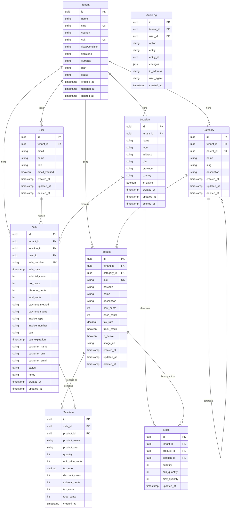

# Database Schema - Retail Super App

## Descripción General

El esquema de base de datos está diseñado para soportar un sistema multi-tenant de gestión retail para PYMEs argentinas. Utiliza PostgreSQL como base de datos principal y Prisma ORM para la gestión del esquema y queries.

## Principios de Diseño

1. **Multi-Tenancy**: Todos los datos están aislados por `tenant_id`
2. **Montos en Centavos**: Todos los valores monetarios se almacenan como integers (centavos) para evitar problemas de precisión
3. **Soft Deletes**: Uso de `deleted_at` para mantener historial
4. **Auditoría**: Tabla `audit_logs` para compliance y trazabilidad
5. **UUIDs**: Uso de UUID v7 (ordenables por tiempo) para IDs

## Diagrama de Entidad-Relación



## Modelos Principales

### Core: Multi-tenancy & Users

#### Tenant
Representa una empresa/comercio que usa el sistema. Aislamiento de datos por tenant.

**Campos clave:**
- `slug`: Identificador único para URLs (`demo.retail.app`)
- `cuit`: CUIT argentino para facturación electrónica AFIP
- `fiscalCondition`: Condición fiscal (RI, Monotributo, Exento)
- `plan`: Plan de suscripción (basic, pro, enterprise)
- `status`: Estado de la cuenta (active, suspended, cancelled)

#### User
Usuarios del sistema (owners, admins, cashiers, viewers).

**Roles:**
- `owner`: Dueño, acceso total
- `admin`: Administrador, gestión completa excepto configuración crítica
- `cashier`: Cajero, solo POS e inventario básico
- `viewer`: Solo lectura de reportes

### Inventory & Products

#### Location
Sucursales, depósitos o puntos de venta físicos.

**Tipos:**
- `store`: Tienda/sucursal con POS
- `warehouse`: Depósito sin venta directa

#### Category
Categorización jerárquica de productos (árbol).

**Ejemplo:**
```
Alimentos
├── Lácteos
│   ├── Leche
│   └── Quesos
└── Panadería
```

#### Product
Productos del inventario.

**Precios:**
- `costCents`: Costo de compra en centavos
- `priceCents`: Precio de venta en centavos
- `taxRate`: Tasa de IVA (0.21 = 21%)

**Identificadores:**
- `sku`: Código interno único por tenant
- `barcode`: Código de barras (EAN-13, UPC-A)

#### Stock
Control de inventario por producto y ubicación.

**Alertas:**
- `minQuantity`: Stock mínimo para alertas
- `maxQuantity`: Stock máximo permitido

### Sales (POS)

#### Sale
Ventas realizadas en el POS.

**Montos:**
- Todos en centavos (integers)
- `subtotalCents`: Subtotal sin impuestos
- `taxCents`: IVA total
- `discountCents`: Descuentos aplicados
- `totalCents`: Total final

**Facturación AFIP:**
- `invoiceType`: A, B, C, E
- `invoiceNumber`: Formato `00001-00012345`
- `cae`: Código de Autorización Electrónico
- `caeExpiration`: Fecha de vencimiento del CAE

**Métodos de pago:**
- `cash`: Efectivo
- `debit_card`: Tarjeta de débito
- `credit_card`: Tarjeta de crédito
- `mercado_pago`: Mercado Pago
- `modo`: MODO
- `transfer`: Transferencia bancaria

#### SaleItem
Items/líneas de una venta (snapshot del producto al momento de venta).

**Snapshot:**
- `productName` y `productSku`: Copias del producto en el momento de la venta
- Preserva el precio histórico aunque cambie después

### Auditoría

#### AuditLog
Registro de todas las acciones importantes para compliance y trazabilidad.

**Acciones:**
- `create`: Creación de entidad
- `update`: Actualización
- `delete`: Eliminación (soft o hard)

**Changes JSON:**
```json
{
  "before": { "price": 1000 },
  "after": { "price": 1200 }
}
```

## Índices y Performance

### Índices principales

1. **Multi-tenancy**: Todos los queries filtran por `tenant_id` primero
2. **Búsquedas frecuentes**:
   - `Product.barcode`: Búsqueda por código de barras en POS
   - `Sale.saleDate`: Reportes por fecha
   - `Sale.paymentStatus`: Ventas pendientes de pago
3. **Relaciones**:
   - Foreign keys indexadas automáticamente
   - Índices compuestos para queries comunes

### Estrategias de optimización

1. **Particionamiento futuro**: Por `tenant_id` y fecha para tablas grandes
2. **Materialized views**: Para reportes complejos
3. **Caching**: Redis para datos de lectura frecuente

## Reglas de Negocio

### Money Handling
```typescript
// ❌ NUNCA hacer esto
const price = 12.50; // float

// ✅ SIEMPRE usar centavos
const priceCents = 1250; // int

// Convertir para display
const display = formatCurrencyARS(priceCents); // "$12,50"
```

### Multi-tenancy
Todos los queries DEBEN incluir `tenant_id` en el WHERE:

```typescript
// ✅ Correcto
const products = await prisma.product.findMany({
  where: { tenantId: user.tenantId }
});

// ❌ Incorrecto - leak de datos entre tenants
const products = await prisma.product.findMany();
```

### Soft Deletes
Usar `deletedAt` en lugar de eliminar físicamente:

```typescript
// Soft delete
await prisma.product.update({
  where: { id },
  data: { deletedAt: new Date() }
});

// Queries deben excluir eliminados
const products = await prisma.product.findMany({
  where: {
    tenantId,
    deletedAt: null // excluir eliminados
  }
});
```

## Migraciones

### Crear migración
```bash
pnpm --filter @retail/database db:migrate
```

### Aplicar migración en producción
```bash
pnpm --filter @retail/database db:push
```

### Resetear DB (desarrollo)
```bash
pnpm --filter @retail/database db:reset
```

## Seed Data

El seed crea datos de prueba para desarrollo:

- 1 tenant: "Demo Store"
- 1 user owner: owner@demo.com
- 1 location: "Sucursal Principal"
- 3 categorías: Alimentos, Bebidas, Limpieza
- 3 productos con stock inicial

```bash
pnpm --filter @retail/database db:seed
```

## Prisma Studio

Interfaz visual para explorar la BD:

```bash
pnpm --filter @retail/database db:studio
```

Abre en `http://localhost:5555`

## Referencias

- [Prisma Schema Reference](https://www.prisma.io/docs/reference/api-reference/prisma-schema-reference)
- [PostgreSQL UUID Best Practices](https://www.cybertec-postgresql.com/en/uuid-serial-or-identity-columns-for-postgresql-auto-generated-primary-keys/)
- [Multi-Tenant Architecture Patterns](https://docs.microsoft.com/en-us/azure/architecture/patterns/multi-tenancy)
