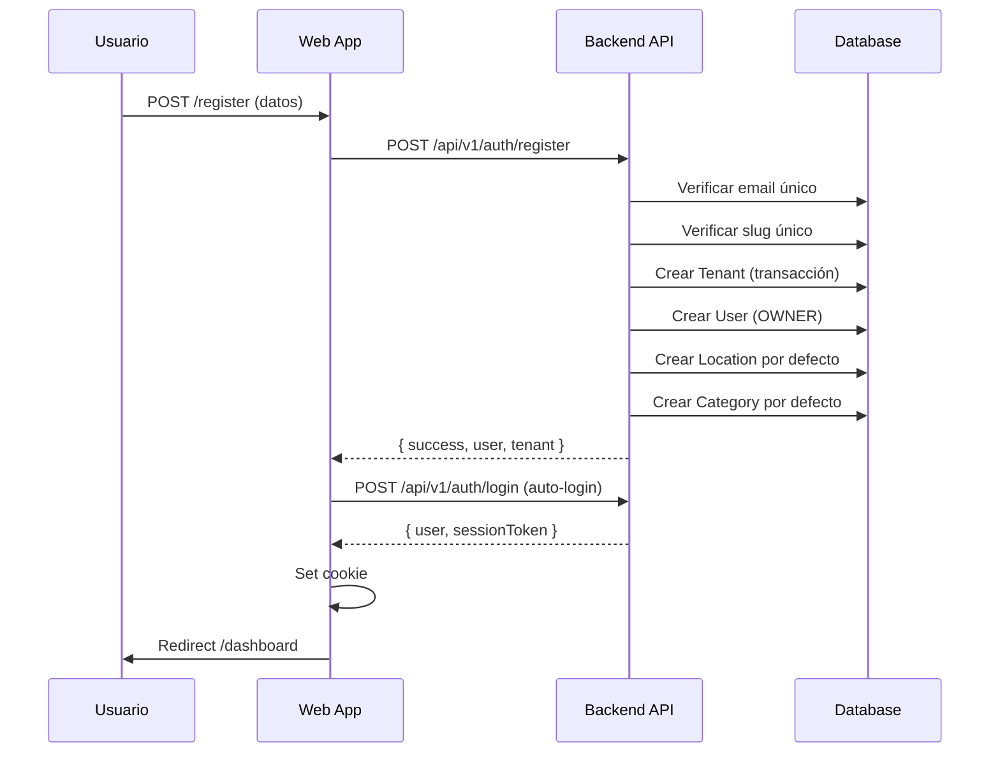
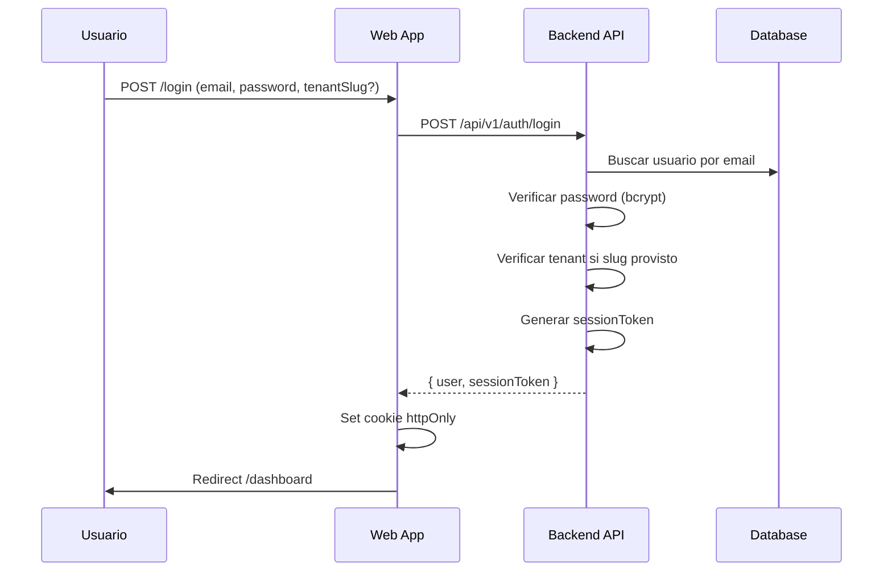
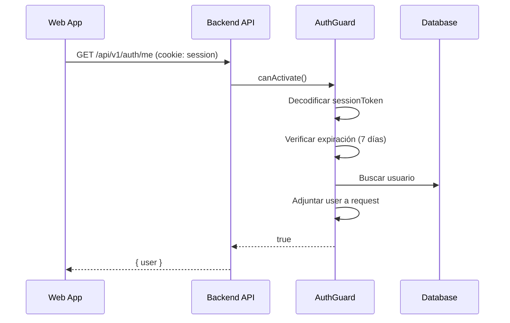
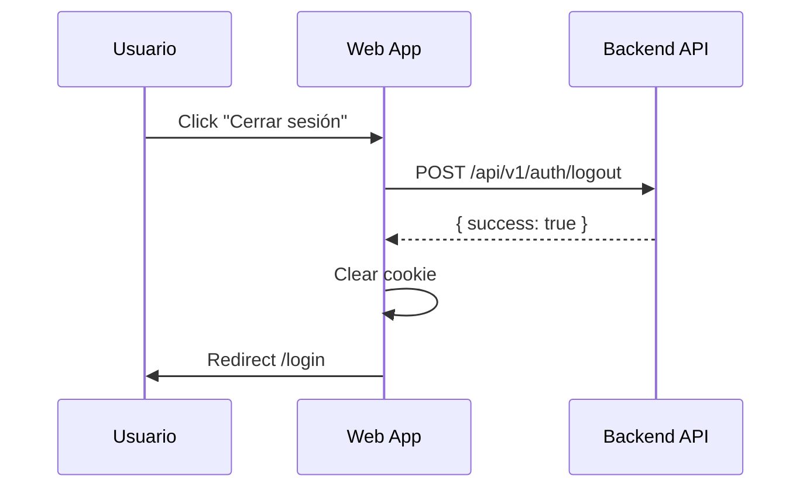

# Autenticación y Autorización - Retail Super App

Sistema de autenticación multi-tenant con soporte de roles y permisos basado en better-auth.

## Tabla de Contenidos

- [Arquitectura](#arquitectura)
- [Roles y Permisos](#roles-y-permisos)
- [Flujo de Autenticación](#flujo-de-autenticación)
- [API Endpoints](#api-endpoints)
- [Uso en Frontend](#uso-en-frontend)
- [Uso en Backend](#uso-en-backend)
- [Seguridad](#seguridad)
- [Configuración](#configuración)

## Arquitectura

### Stack Tecnológico

- **Backend**: better-auth + bcryptjs
- **Frontend**: Custom React hooks + Context API
- **Sesiones**: HTTP-only cookies (7 días de duración)
- **Multi-tenant**: Aislamiento por `tenantId` y `tenantSlug`
- **Permisos**: Sistema basado en roles (RBAC)

### Componentes Principales

```
packages/shared/src/auth/
├── auth.types.ts         # Tipos TypeScript compartidos
├── permissions.ts        # Sistema de permisos RBAC
└── index.ts

apps/api/src/modules/auth/
├── better-auth.config.ts # Configuración de better-auth
├── auth.service.ts       # Lógica de negocio
├── auth.controller.ts    # Endpoints REST
├── auth.module.ts        # Módulo NestJS
└── dto/                  # DTOs de validación

apps/api/src/common/guards/
└── auth.guard.ts         # Guard de autenticación

apps/web/src/lib/auth/
├── client.ts             # Cliente HTTP
├── hooks.ts              # React hooks
└── provider.tsx          # Context Provider
```

## Roles y Permisos

### Roles Disponibles

| Rol | Descripción | Nivel de Acceso |
|-----|-------------|-----------------|
| `OWNER` | Dueño de la empresa | Acceso total |
| `ADMIN` | Administrador | Casi todos los permisos excepto configuración crítica |
| `CASHIER` | Cajero | Solo POS, inventario (lectura), clientes |
| `VIEWER` | Visor | Solo lectura en la mayoría de módulos |

### Sistema de Permisos

Definido en `@retail/shared/auth/permissions.ts`:

```typescript
export const PERMISSIONS = {
  // POS
  'pos:read': 'Ver punto de venta',
  'pos:write': 'Procesar ventas',
  'pos:refund': 'Hacer devoluciones',

  // Inventory
  'inventory:read': 'Ver inventario',
  'inventory:write': 'Gestionar productos',
  'inventory:adjust': 'Ajustar stock',

  // Sales
  'sales:read': 'Ver ventas',
  'sales:export': 'Exportar reportes',

  // Customers
  'customers:read': 'Ver clientes',
  'customers:write': 'Gestionar clientes',

  // Users
  'users:read': 'Ver usuarios',
  'users:write': 'Gestionar usuarios',
  'users:delete': 'Eliminar usuarios',

  // Settings
  'settings:read': 'Ver configuración',
  'settings:write': 'Modificar configuración',

  // Reports
  'reports:read': 'Ver reportes',
  'reports:advanced': 'Reportes avanzados',
};
```

### Matriz de Permisos por Rol

```typescript
export const ROLE_PERMISSIONS: Record<UserRole, Permission[]> = {
  OWNER: [/* Todos los permisos */],
  ADMIN: [
    'pos:read', 'pos:write', 'pos:refund',
    'inventory:read', 'inventory:write', 'inventory:adjust',
    'sales:read', 'sales:export',
    'customers:read', 'customers:write',
    'users:read',
    'settings:read',
    'reports:read', 'reports:advanced',
  ],
  CASHIER: [
    'pos:read', 'pos:write',
    'inventory:read',
    'customers:read',
    'sales:read',
  ],
  VIEWER: [
    'pos:read',
    'inventory:read',
    'sales:read',
    'customers:read',
    'reports:read',
  ],
};
```

### Funciones de Verificación

```typescript
import { hasPermission, hasAnyPermission, hasAllPermissions } from '@retail/shared';

// Verificar un permiso
if (hasPermission(user.role, 'inventory:write')) {
  // Usuario puede editar inventario
}

// Verificar cualquiera de varios permisos
if (hasAnyPermission(user.role, ['sales:read', 'sales:export'])) {
  // Usuario puede ver o exportar ventas
}

// Verificar todos los permisos
if (hasAllPermissions(user.role, ['users:read', 'users:write'])) {
  // Usuario puede leer y escribir usuarios
}
```

## Flujo de Autenticación

### Registro de Nuevo Usuario



**Pasos:**

1. Usuario completa formulario de registro
2. Frontend envía datos a `/api/v1/auth/register`
3. Backend valida unicidad de email y slug
4. Se crea en transacción:
   - Tenant
   - Usuario con rol OWNER
   - Ubicación por defecto "Sucursal Principal"
   - Categoría por defecto "General"
5. Se hace auto-login después del registro
6. Se establece cookie de sesión
7. Redirección al dashboard

### Login de Usuario Existente



**Pasos:**

1. Usuario ingresa credenciales
2. Opcionalmente ingresa `tenantSlug` (si tiene acceso a múltiples tenants)
3. Backend busca usuario por email
4. Verifica password con bcrypt
5. Si hay `tenantSlug`, verifica que coincida
6. Genera token de sesión (base64 con userId, tenantId, timestamp)
7. Retorna usuario y token
8. Frontend guarda token en cookie httpOnly
9. Redirección al dashboard

### Verificación de Sesión



**Pasos:**

1. Frontend hace request a endpoint protegido
2. Cookie de sesión se envía automáticamente
3. AuthGuard intercepta la request
4. Decodifica el token de sesión
5. Verifica que no haya expirado (7 días)
6. Busca el usuario en base de datos
7. Adjunta el usuario completo al objeto request
8. Continúa con el handler del endpoint

### Logout



## API Endpoints

### POST /api/v1/auth/register

Registro de nuevo usuario y tenant.

**Request Body:**
```json
{
  "name": "Juan Pérez",
  "email": "admin@ejemplo.com",
  "password": "password123",
  "tenantName": "Mi Empresa S.A.",
  "tenantSlug": "mi-empresa",
  "country": "AR"
}
```

**Validaciones:**
- `email`: Email válido, no registrado
- `password`: Mínimo 6 caracteres
- `tenantSlug`: Solo letras minúsculas, números y guiones. Único.

**Response (201 Created):**
```json
{
  "success": true,
  "message": "User and tenant created successfully",
  "user": {
    "id": "uuid",
    "email": "admin@ejemplo.com",
    "name": "Juan Pérez",
    "role": "OWNER",
    "tenantId": "tenant-uuid",
    "tenantSlug": "mi-empresa"
  },
  "tenant": {
    "id": "tenant-uuid",
    "name": "Mi Empresa S.A.",
    "slug": "mi-empresa"
  }
}
```

**Errores:**
- `400 Bad Request`: Email ya registrado, slug ya usado, datos inválidos
- `500 Internal Server Error`: Error en base de datos

---

### POST /api/v1/auth/login

Login de usuario existente.

**Request Body:**
```json
{
  "email": "admin@ejemplo.com",
  "password": "password123",
  "tenantSlug": "mi-empresa"
}
```

**Response (200 OK):**
```json
{
  "success": true,
  "user": {
    "id": "uuid",
    "email": "admin@ejemplo.com",
    "name": "Juan Pérez",
    "role": "OWNER",
    "tenantId": "tenant-uuid",
    "tenantSlug": "mi-empresa",
    "emailVerified": false
  },
  "sessionToken": "base64-encoded-token"
}
```

**Headers Set:**
```
Set-Cookie: session=<sessionToken>; HttpOnly; Secure; SameSite=Lax; Max-Age=604800
```

**Errores:**
- `401 Unauthorized`: Credenciales inválidas, tenant mismatch

---

### GET /api/v1/auth/me

Obtener usuario actual de la sesión.

**Headers Required:**
```
Cookie: session=<sessionToken>
```

**Response (200 OK):**
```json
{
  "id": "uuid",
  "email": "admin@ejemplo.com",
  "name": "Juan Pérez",
  "role": "OWNER",
  "tenantId": "tenant-uuid",
  "tenantSlug": "mi-empresa",
  "emailVerified": false
}
```

**Errores:**
- `401 Unauthorized`: Token inválido o expirado

---

### POST /api/v1/auth/logout

Cerrar sesión.

**Headers Required:**
```
Cookie: session=<sessionToken>
```

**Response (200 OK):**
```json
{
  "success": true,
  "message": "Logged out successfully"
}
```

**Headers Set:**
```
Set-Cookie: session=; Max-Age=0
```

---

### POST /api/v1/auth/forgot-password

Solicitar restablecimiento de contraseña.

**Request Body:**
```json
{
  "email": "admin@ejemplo.com"
}
```

**Response (200 OK):**
```json
{
  "success": true,
  "message": "If the email exists, a password reset link has been sent"
}
```

**Nota:** Por seguridad, siempre retorna success, incluso si el email no existe.

---

### POST /api/v1/auth/reset-password

Restablecer contraseña con token.

**Request Body:**
```json
{
  "token": "reset-token-from-email",
  "password": "new-password123"
}
```

**Response (200 OK):**
```json
{
  "success": true,
  "message": "Password reset successfully"
}
```

**Errores:**
- `400 Bad Request`: Token inválido o expirado

---

## Uso en Frontend

### Configuración Inicial

**1. Agregar AuthProvider en layout raíz:**

```typescript
// apps/web/src/app/providers.tsx
import { AuthProvider } from '@/lib/auth/provider';

export function Providers({ children }) {
  return (
    <QueryClientProvider client={queryClient}>
      <AuthProvider>
        {children}
      </AuthProvider>
    </QueryClientProvider>
  );
}
```

### Hook useAuthContext

```typescript
'use client';

import { useAuthContext } from '@/lib/auth/provider';

export default function MyComponent() {
  const { user, isAuthenticated, loading, login, logout } = useAuthContext();

  if (loading) {
    return <div>Cargando...</div>;
  }

  if (!isAuthenticated) {
    return <div>No autenticado</div>;
  }

  return (
    <div>
      <h1>Bienvenido, {user.name}</h1>
      <p>Email: {user.email}</p>
      <p>Rol: {user.role}</p>
      <p>Empresa: {user.tenantSlug}</p>
      <button onClick={logout}>Cerrar sesión</button>
    </div>
  );
}
```

### Verificar Permisos en Componentes

```typescript
import { useAuthContext } from '@/lib/auth/provider';
import { hasPermission } from '@retail/shared';

export default function ProductsPage() {
  const { user } = useAuthContext();

  const canEdit = hasPermission(user.role, 'inventory:write');
  const canDelete = hasPermission(user.role, 'inventory:delete');

  return (
    <div>
      <h1>Productos</h1>
      {canEdit && <button>Editar</button>}
      {canDelete && <button>Eliminar</button>}
    </div>
  );
}
```

### Proteger Rutas

```typescript
// apps/web/src/middleware.ts
import { NextResponse } from 'next/server';
import type { NextRequest } from 'next/server';

export function middleware(request: NextRequest) {
  const sessionToken = request.cookies.get('session')?.value;

  // Rutas públicas
  const publicRoutes = ['/login', '/register', '/'];
  if (publicRoutes.includes(request.nextUrl.pathname)) {
    return NextResponse.next();
  }

  // Verificar sesión para rutas privadas
  if (!sessionToken) {
    return NextResponse.redirect(new URL('/login', request.url));
  }

  return NextResponse.next();
}

export const config = {
  matcher: ['/((?!api|_next/static|_next/image|favicon.ico).*)'],
};
```

## Uso en Backend

### Proteger Endpoints con AuthGuard

```typescript
import { Controller, Get, UseGuards } from '@nestjs/common';
import { AuthGuard } from '@/common/guards/auth.guard';

@Controller('products')
@UseGuards(AuthGuard) // Protege todo el controlador
export class ProductsController {
  @Get()
  async findAll(@Req() req: Request) {
    // req.user contiene el usuario autenticado
    const user = req.user;
    console.log(user.role, user.tenantId);

    return this.productsService.findAll(user.tenantId);
  }
}
```

### Verificar Permisos en Services

```typescript
import { Injectable, ForbiddenException } from '@nestjs/common';
import { hasPermission } from '@retail/shared';

@Injectable()
export class ProductsService {
  async delete(user: AuthUser, productId: string) {
    // Verificar permiso
    if (!hasPermission(user.role, 'inventory:delete')) {
      throw new ForbiddenException('No tienes permiso para eliminar productos');
    }

    // Continuar con la lógica
    return this.prisma.product.delete({
      where: { id: productId, tenantId: user.tenantId },
    });
  }
}
```

### Custom Decorator para Permisos

```typescript
// apps/api/src/common/decorators/require-permission.decorator.ts
import { SetMetadata } from '@nestjs/common';
import { Permission } from '@retail/shared';

export const PERMISSION_KEY = 'permission';
export const RequirePermission = (...permissions: Permission[]) =>
  SetMetadata(PERMISSION_KEY, permissions);
```

```typescript
// apps/api/src/common/guards/permission.guard.ts
import { Injectable, CanActivate, ExecutionContext } from '@nestjs/common';
import { Reflector } from '@nestjs/core';
import { hasAllPermissions } from '@retail/shared';
import { PERMISSION_KEY } from '../decorators/require-permission.decorator';

@Injectable()
export class PermissionGuard implements CanActivate {
  constructor(private reflector: Reflector) {}

  canActivate(context: ExecutionContext): boolean {
    const requiredPermissions = this.reflector.getAllAndOverride<Permission[]>(
      PERMISSION_KEY,
      [context.getHandler(), context.getClass()]
    );

    if (!requiredPermissions) {
      return true;
    }

    const request = context.switchToHttp().getRequest();
    const user = request.user;

    return hasAllPermissions(user.role, requiredPermissions);
  }
}
```

**Uso:**

```typescript
import { Controller, Delete, UseGuards } from '@nestjs/common';
import { AuthGuard } from '@/common/guards/auth.guard';
import { PermissionGuard } from '@/common/guards/permission.guard';
import { RequirePermission } from '@/common/decorators/require-permission.decorator';

@Controller('products')
@UseGuards(AuthGuard, PermissionGuard)
export class ProductsController {
  @Delete(':id')
  @RequirePermission('inventory:delete')
  async delete(@Param('id') id: string) {
    // Solo usuarios con permiso 'inventory:delete' pueden acceder
    return this.productsService.delete(id);
  }
}
```

## Seguridad

### Mejores Prácticas Implementadas

1. **Passwords**
   - Hash con bcryptjs (salt rounds: 10)
   - Mínimo 6 caracteres (recomendado: 8+)
   - No almacenar en logs

2. **Sesiones**
   - Cookies httpOnly (no accesibles desde JavaScript)
   - Secure flag en producción (HTTPS only)
   - SameSite=Lax (protección CSRF)
   - Expiración: 7 días

3. **Tokens**
   - Base64 encoding con userId, tenantId, timestamp
   - Verificación de expiración en cada request
   - No contienen información sensible

4. **Multi-tenant**
   - Aislamiento estricto por tenantId
   - Validación de pertenencia al tenant
   - Índices en base de datos por tenantId

5. **Rate Limiting**
   - Configurado en NestJS con Throttler
   - 100 requests por minuto por IP

6. **Validación**
   - DTOs con class-validator
   - Sanitización de inputs
   - Whitelist de propiedades

### Recomendaciones Adicionales

- [ ] Implementar verificación de email
- [ ] Agregar 2FA (autenticación de dos factores)
- [ ] Implementar refresh tokens
- [ ] Agregar logs de actividad (audit log)
- [ ] Configurar CSP headers
- [ ] Implementar rate limiting por usuario
- [ ] Agregar detección de sesiones anómalas
- [ ] Encriptar datos sensibles en base de datos

## Configuración

### Variables de Entorno

**Backend (`apps/api/.env`):**

```bash
# Better Auth
BETTER_AUTH_SECRET=your-secret-key-min-32-chars-change-in-production
BETTER_AUTH_URL=http://localhost:3001
API_URL=http://localhost:3001

# OAuth (opcional)
GOOGLE_CLIENT_ID=
GOOGLE_CLIENT_SECRET=

# Cookies
COOKIE_DOMAIN=localhost

# Email (opcional)
SMTP_HOST=
SMTP_PORT=587
SMTP_USER=
SMTP_PASSWORD=
SMTP_FROM=noreply@retail-app.com
```

**Frontend (`apps/web/.env.local`):**

```bash
NEXT_PUBLIC_API_URL=http://localhost:3001/api/v1

BETTER_AUTH_SECRET=your-secret-key-min-32-chars-change-in-production
BETTER_AUTH_URL=http://localhost:3001
```

### Producción

**Backend:**

```bash
BETTER_AUTH_SECRET=<generar con openssl rand -base64 32>
BETTER_AUTH_URL=https://api.tu-dominio.com
COOKIE_DOMAIN=tu-dominio.com
NODE_ENV=production
```

**Frontend:**

```bash
NEXT_PUBLIC_API_URL=https://api.tu-dominio.com/api/v1
BETTER_AUTH_URL=https://api.tu-dominio.com
NODE_ENV=production
```

## Próximas Mejoras

- [ ] Implementar OAuth con Google, GitHub
- [ ] Agregar verificación de email con tokens
- [ ] Implementar recuperación de contraseña completa
- [ ] Agregar refresh tokens
- [ ] Implementar 2FA con TOTP
- [ ] Agregar magic links para login sin contraseña
- [ ] Implementar audit logs
- [ ] Agregar gestión de sesiones activas
- [ ] Implementar revocación de sesiones
- [ ] Agregar webhooks para eventos de autenticación

---

**Documentación actualizada:** 2025-01-15
**Versión:** 1.0.0
