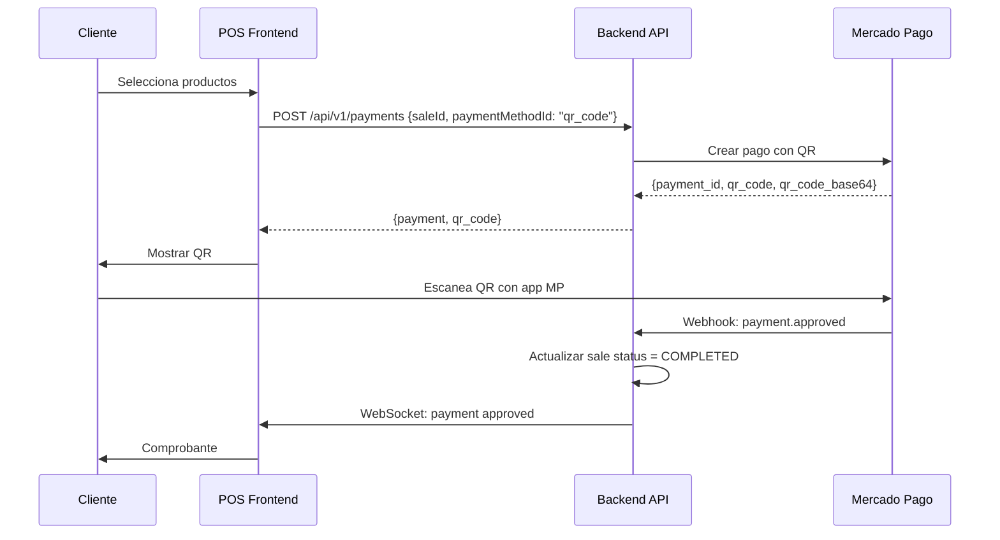
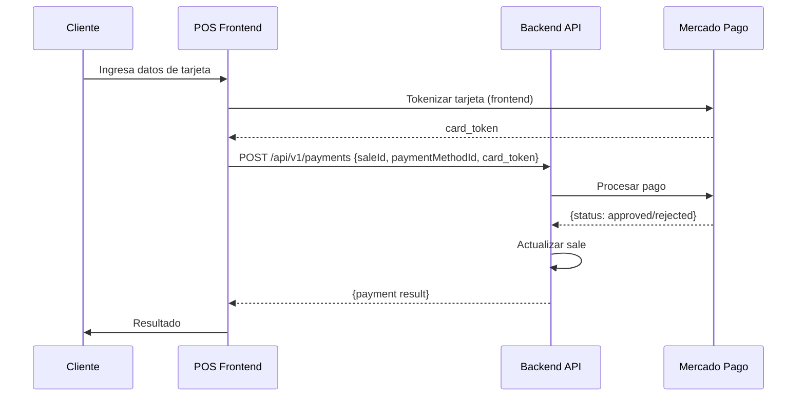
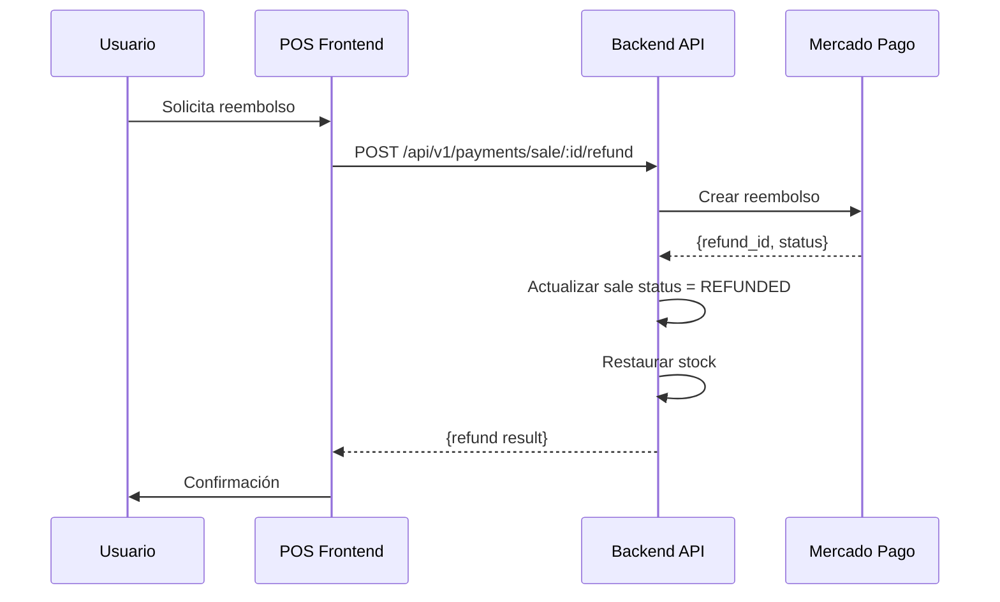

# Integración Mercado Pago - Retail Super App

Integración completa con Mercado Pago para procesamiento de pagos en el POS.

## Tabla de Contenidos

- [Características](#características)
- [Configuración](#configuración)
- [Métodos de Pago Soportados](#métodos-de-pago-soportados)
- [Flujos de Pago](#flujos-de-pago)
- [API Endpoints](#api-endpoints)
- [Webhooks](#webhooks)
- [Comisiones](#comisiones)
- [Testing](#testing)
- [Producción](#producción)

## Características

- **Procesamiento de pagos** con múltiples métodos
- **QR Mercado Pago** para pagos sin contacto
- **Tarjetas de crédito y débito**
- **PIX** (Brasil)
- **Reembolsos** parciales y totales
- **Webhooks** para notificaciones en tiempo real
- **Cálculo automático de comisiones**
- **Soporte multi-tenant**

## Configuración

### 1. Obtener Credenciales

1. Ir a [Mercado Pago Developers](https://www.mercadopago.com.ar/developers/)
2. Crear una aplicación
3. Obtener credenciales de **TEST** y **PRODUCCIÓN**

**Credenciales necesarias:**
- `ACCESS_TOKEN`: Token de acceso (comienza con `APP_USR-` o `TEST-`)
- `PUBLIC_KEY`: Clave pública para frontend
- `WEBHOOK_SECRET`: Secret para verificar webhooks (opcional)

### 2. Variables de Entorno

Agregar a `apps/api/.env`:

```bash
# Mercado Pago - Credenciales de TEST
MERCADO_PAGO_ACCESS_TOKEN=TEST-1234567890-abcdef-your-token
MERCADO_PAGO_PUBLIC_KEY=TEST-abc123-your-public-key
MERCADO_PAGO_WEBHOOK_URL=https://your-domain.com/api/v1/payments/webhooks/mercadopago
MERCADO_PAGO_WEBHOOK_SECRET=your-webhook-secret

# Para PRODUCCIÓN (cambiar cuando esté listo)
# MERCADO_PAGO_ACCESS_TOKEN=APP_USR-1234567890-abcdef-your-token
# MERCADO_PAGO_PUBLIC_KEY=APP_USR-abc123-your-public-key
```

### 3. Configurar Webhook

1. Ir al panel de Mercado Pago
2. Configurar webhook URL: `https://your-domain.com/api/v1/payments/webhooks/mercadopago`
3. Seleccionar eventos: `payment`, `merchant_order`
4. Guardar configuración

**Para desarrollo local con ngrok:**
```bash
ngrok http 3001
# Usar URL de ngrok como MERCADO_PAGO_WEBHOOK_URL
```

## Métodos de Pago Soportados

### Argentina

| Método | ID Mercado Pago | Disponible |
|--------|-----------------|------------|
| Dinero en cuenta | `account_money` | ✅ |
| Tarjeta de débito | `debit_card`, `debmaster`, `debvisa` | ✅ |
| Tarjeta de crédito | `credit_card`, `master`, `visa`, `amex` | ✅ |
| Transferencia bancaria | `bank_transfer` | ✅ |
| Efectivo (Rapipago, PagoFacil) | `rapipago`, `pagofacil` | ✅ |
| QR Mercado Pago | `qr_code` | ✅ |

### Brasil

| Método | ID Mercado Pago | Disponible |
|--------|-----------------|------------|
| PIX | `pix` | ✅ |
| Boleto bancário | `bolbradesco` | ✅ |
| Tarjetas | `master`, `visa` | ✅ |

## Flujos de Pago

### Flujo 1: Pago con QR Mercado Pago



### Flujo 2: Pago con Tarjeta



### Flujo 3: Reembolso



## API Endpoints

### POST /api/v1/payments

Crear un nuevo pago para una venta.

**Headers:**
```
x-tenant-id: tenant-uuid
Authorization: Bearer <token>
```

**Request Body:**
```json
{
  "saleId": "sale-uuid",
  "userId": "user-uuid",
  "paymentMethodId": "pix",
  "email": "customer@example.com",
  "metadata": {
    "customerName": "Juan Pérez"
  }
}
```

**Response (201 Created):**
```json
{
  "success": true,
  "data": {
    "sale": {
      "id": "sale-uuid",
      "saleNumber": "VTA-2025-0001",
      "status": "PENDING",
      "paymentMethod": "MERCADO_PAGO",
      "totalCents": 10000,
      "notes": {
        "mercadoPagoPaymentId": "123456789",
        "paymentMetadata": {
          "qr_code": "00020126...",
          "qr_code_base64": "iVBORw0KGgo...",
          "ticket_url": "https://..."
        }
      }
    },
    "payment": {
      "id": "123456789",
      "status": "PENDING",
      "amountCents": 10000,
      "paidCents": 0,
      "method": "MERCADO_PAGO",
      "externalId": "123456789",
      "metadata": {
        "qr_code": "00020126...",
        "qr_code_base64": "iVBORw0KGgo..."
      }
    }
  }
}
```

**Errores:**
- `404 Not Found`: Venta no encontrada
- `400 Bad Request`: Venta ya pagada

---

### GET /api/v1/payments/:id

Obtener estado de un pago.

**Response (200 OK):**
```json
{
  "success": true,
  "data": {
    "id": "123456789",
    "status": "APPROVED",
    "amountCents": 10000,
    "paidCents": 10000,
    "method": "MERCADO_PAGO",
    "approvalCode": "1234",
    "metadata": {
      "status_detail": "accredited",
      "payment_method": "pix",
      "payment_type": "bank_transfer"
    }
  }
}
```

---

### GET /api/v1/payments/sale/:saleId

Obtener pago asociado a una venta.

**Response (200 OK):**
```json
{
  "success": true,
  "data": {
    "id": "123456789",
    "status": "APPROVED",
    "amountCents": 10000,
    "paidCents": 10000,
    "method": "MERCADO_PAGO"
  }
}
```

**Errores:**
- `404 Not Found`: Venta no encontrada o sin pago asociado

---

### POST /api/v1/payments/sale/:saleId/refund

Reembolsar un pago (parcial o total).

**Request Body:**
```json
{
  "amountCents": 5000
}
```

Si no se especifica `amountCents`, se reembolsa el monto total.

**Response (200 OK):**
```json
{
  "success": true,
  "data": {
    "refund": {
      "id": "987654321",
      "status": "REFUNDED",
      "amountCents": 5000
    },
    "sale": {
      "id": "sale-uuid",
      "status": "REFUNDED"
    }
  }
}
```

**Errores:**
- `404 Not Found`: Venta o pago no encontrado
- `400 Bad Request`: Venta ya reembolsada

---

### GET /api/v1/payments/commission/rates

Obtener tasas de comisión de Mercado Pago.

**Response (200 OK):**
```json
{
  "success": true,
  "data": {
    "money_in_account": 0.008,
    "debit_card": 0.0124,
    "credit_card": {
      "instant": 0.0649,
      "10_days": 0.0429,
      "18_days": 0.0339,
      "35_days": 0.0179,
      "70_days": 0.0
    }
  }
}
```

---

### GET /api/v1/payments/commission/calculate

Calcular comisión para un monto.

**Query Parameters:**
- `amountCents` (required): Monto en centavos
- `paymentMethod` (required): Método de pago
- `installments` (optional): Número de cuotas (default: 1)

**Ejemplo:**
```
GET /api/v1/payments/commission/calculate?amountCents=10000&paymentMethod=credit_card&installments=1
```

**Response (200 OK):**
```json
{
  "success": true,
  "data": {
    "amountCents": 10000,
    "commissionCents": 649,
    "netAmountCents": 9351
  }
}
```

## Webhooks

### POST /api/v1/payments/webhooks/mercadopago

Endpoint público para recibir notificaciones de Mercado Pago.

**Sin autenticación** (verificar signature en producción).

**Request Body:**
```json
{
  "type": "payment",
  "action": "payment.updated",
  "data": {
    "id": "123456789"
  },
  "date_created": 1641234567890,
  "live_mode": true
}
```

**Tipos de eventos:**
- `payment` - Actualización de pago
- `merchant_order` - Actualización de orden

**Response (200 OK):**
```json
{
  "success": true
}
```

### Verificar Signature (TODO)

Para producción, implementar verificación de firma:

```typescript
import crypto from 'crypto';

function verifyWebhookSignature(body: string, signature: string): boolean {
  const secret = process.env.MERCADO_PAGO_WEBHOOK_SECRET;
  const hash = crypto
    .createHmac('sha256', secret)
    .update(body)
    .digest('hex');

  return hash === signature;
}
```

## Comisiones

### Tasas Vigentes (Argentina 2025)

| Método | Comisión |
|--------|----------|
| Dinero en cuenta MP | 0.8% |
| Tarjeta de débito | 1.24% |
| Tarjeta de crédito (instantáneo) | 6.49% |
| Tarjeta de crédito (10 días) | 4.29% |
| Tarjeta de crédito (18 días) | 3.39% |
| Tarjeta de crédito (35 días) | 1.79% |
| Tarjeta de crédito (70 días) | Gratis |

**Nota:** Estas tasas son aproximadas y pueden variar. Consultar [costos oficiales](https://www.mercadopago.com.ar/costs-section/how-much-cost).

### Cálculo de Comisión

```typescript
const commission = paymentsService.calculateCommission(
  10000, // $100.00
  'credit_card',
  1 // cuotas
);

console.log(commission); // 649 centavos = $6.49
```

### Registrar Comisión en Venta

```typescript
// En el service al crear pago
const commission = this.calculateCommission(
  sale.totalCents,
  paymentMethodId,
  installments
);

await this.prisma.sale.update({
  where: { id: sale.id },
  data: {
    notes: {
      ...saleNotes,
      mercadoPagoCommissionCents: commission,
      netAmountCents: sale.totalCents - commission,
    },
  },
});
```

## Testing

### 1. Usar Credenciales de TEST

Todas las credenciales de test comienzan con `TEST-`:
```bash
MERCADO_PAGO_ACCESS_TOKEN=TEST-1234567890-abcdef-your-token
```

### 2. Tarjetas de Prueba

| Tarjeta | Número | CVV | Vencimiento | Resultado |
|---------|--------|-----|-------------|-----------|
| Visa | 4509 9535 6623 3704 | 123 | 11/25 | Aprobado |
| Mastercard | 5031 7557 3453 0604 | 123 | 11/25 | Aprobado |
| Visa | 4074 0000 0000 0004 | 123 | 11/25 | Rechazado |

### 3. Usuarios de Prueba

Crear en [panel de Mercado Pago](https://www.mercadopago.com.ar/developers/panel/test-users):
- **Vendedor**: Para recibir pagos
- **Comprador**: Para hacer pagos

### 4. Testing Local

```bash
# 1. Instalar ngrok
npm install -g ngrok

# 2. Exponer puerto local
ngrok http 3001

# 3. Configurar webhook URL con URL de ngrok
# https://abc123.ngrok.io/api/v1/payments/webhooks/mercadopago

# 4. Hacer un pago de prueba
curl -X POST http://localhost:3001/api/v1/payments \
  -H "Content-Type: application/json" \
  -H "x-tenant-id: your-tenant-id" \
  -H "Authorization: Bearer your-token" \
  -d '{
    "saleId": "sale-uuid",
    "userId": "user-uuid",
    "paymentMethodId": "pix"
  }'

# 5. Ver logs del webhook
# Mercado Pago enviará notificaciones a ngrok URL
```

## Producción

### 1. Cambiar a Credenciales de PRODUCCIÓN

```bash
# .env
MERCADO_PAGO_ACCESS_TOKEN=APP_USR-1234567890-abcdef-your-token
MERCADO_PAGO_PUBLIC_KEY=APP_USR-abc123-your-public-key
MERCADO_PAGO_WEBHOOK_URL=https://api.your-domain.com/api/v1/payments/webhooks/mercadopago
```

### 2. Configurar Webhook en Producción

1. Panel de Mercado Pago > Tu aplicación > Webhooks
2. URL: `https://api.your-domain.com/api/v1/payments/webhooks/mercadopago`
3. Eventos: `payment`, `merchant_order`

### 3. Implementar Verificación de Signature

Ver sección [Verificar Signature](#verificar-signature-todo).

### 4. Monitoreo

- Configurar logs en producción
- Monitorear tasas de aprobación/rechazo
- Alertas para webhooks fallidos
- Dashboard de pagos en tiempo real

### 5. Cumplimiento PCI-DSS

- **Nunca** almacenar datos de tarjetas
- Usar `card_token` generado en frontend
- HTTPS obligatorio
- Cumplir con [PCI-DSS](https://www.pcisecuritystandards.org/)

## Troubleshooting

### Error: "MERCADO_PAGO_ACCESS_TOKEN is required"

**Solución:** Configurar variable de entorno en `.env`:
```bash
MERCADO_PAGO_ACCESS_TOKEN=TEST-your-token
```

### Webhook no llega

**Posibles causas:**
1. URL no accesible públicamente
2. Firewall bloqueando
3. HTTPS no configurado (requerido en producción)

**Solución desarrollo:**
- Usar ngrok para exponer localhost
- Verificar logs de ngrok: `http://127.0.0.1:4040`

### Pago rechazado

**Verificar:**
1. Tarjeta de prueba válida
2. Fondos suficientes (en prueba, siempre hay)
3. Límites de la cuenta

**Logs:**
```typescript
this.logger.error('Payment rejected', {
  paymentId,
  status_detail: response.status_detail,
});
```

### Comisión incorrecta

**Solución:**
- Actualizar tasas en `getCommissionRates()`
- Consultar [tarifas oficiales](https://www.mercadopago.com.ar/costs-section/how-much-cost)

## Próximas Mejoras

- [ ] Soporte para otros países (Brasil, México, Chile)
- [ ] Pagos con cuotas sin interés
- [ ] Integración con Mercado Pago Point (dispositivo físico)
- [ ] Split de pagos (marketplace)
- [ ] Suscripciones recurrentes
- [ ] Pagos con link de pago
- [ ] Dashboard de analytics de pagos
- [ ] Integración con AFIP para facturación automática

---

**Documentación actualizada:** 2025-01-15
**SDK:** mercadopago v2.9.0
**Versión:** 1.0.0
